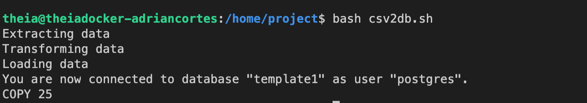

# Description 
* Create a shell scripts to extract, transform, and load data
* Create and populate a PostgreSQL table

## Scenario 
The ETL shell pipeline for this project will complete the following:  
* Extract the user name, user id, and home directory path of each user account defined in the /etc/passwd file.
* Save the data into a comma separated (CSV) format.
* Load the data in the csv file into a table in PostgreSQL database.

**Output**: 

## Notable Linux commands

### Extracting data using **cut** command
The filter command cut helps extract selected characters or fields from a line of text 

Example: 
$ echo "database" | cut -c1-4 

data

Extracting fields/columns - You can extract a specific column/field from a delimited text file, by mentioning:
* the delimiter using the **-d** option
* the field number using the **-f** option 

### Transforming data using **tr**
The filter command tr is used to translate, squeeze, and/or delete characters 

Example: Translate from one character set to antother  
$ echo "Shell Scripting" | tr "[a-z]" "[A-Z]" 

SHELL SCRIPTING
