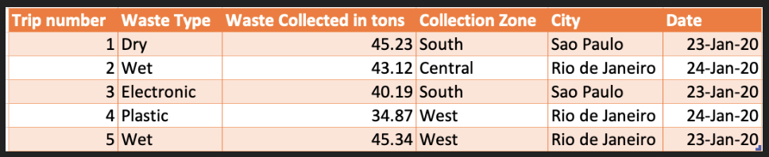
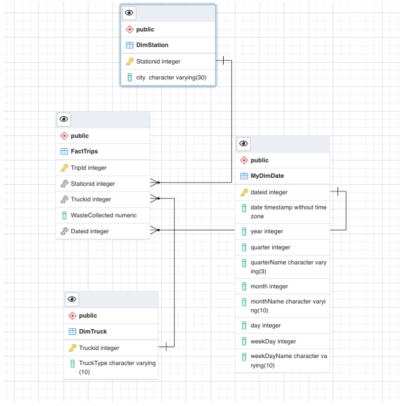

## Description 
* Design and load data into a data warehouse using facts and dimension tables
* Perform aggregation queries to identify certain information in the data and create a materialized view 

## Scenario 
I have been assigned the role of a data engineer at a solid waste management company. The company collects and recycles solid waste across major cities in the country of Brazil. The company operates hundreds of trucks of different types to collect and transport solid waste. The company will like to create a data warehouse to perform the following reports:

* total waste collected per year per city
* total waste collected per month per city
* total waste collected per quarter per city
* total waste collected per year per truck type
* total waste collected per truck type per city
* total waste collected per truck type per station per city

## Design
The solid waste management company has provided a sample of the data they wish to collect:

I will implement a **star schema** for this data warehouse due to ease of querying the data and .... The fact and dimension tables are defined below in the ERD: 

